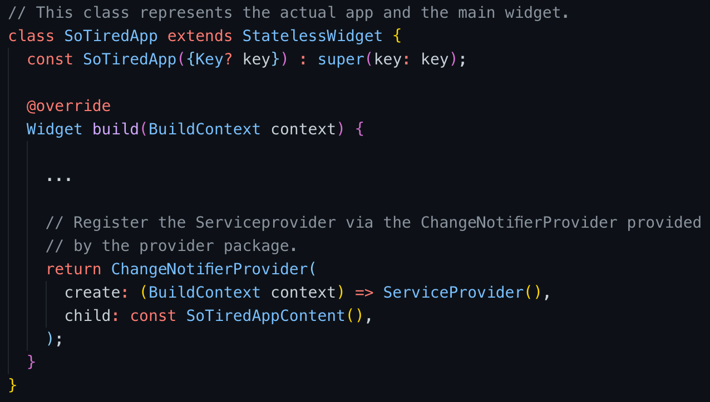
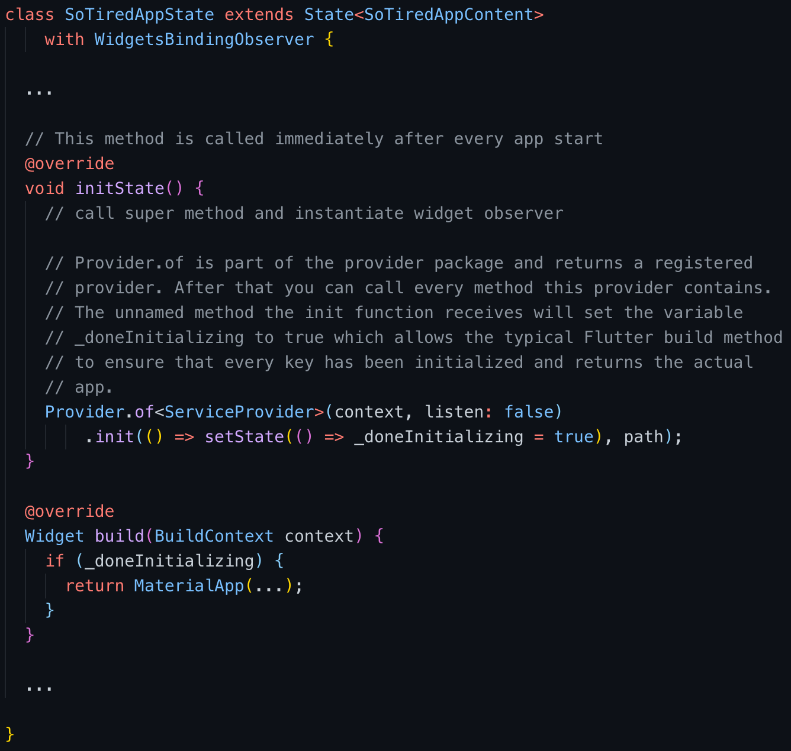
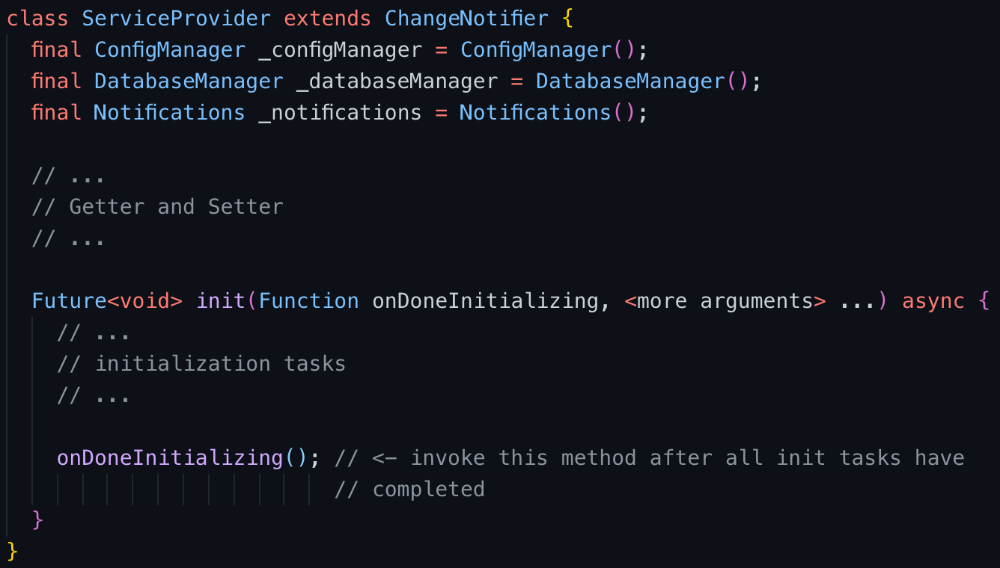

## Flutter application

*Flutter* is a open source framework developed by Google. 
*Flutter* gives you the ability to create several applications (iOS, Android,
web application) with a single code base. 
Because of this, the development does not take place platform-specifically,
but in one programming language and environment. 
The programming language used with *Flutter* is *Dart*. 
*Dart* is an object oriented programming language that is very similar to C#
or Java. 

Its advantage over Java, C# etc. is a modern implementation where common 
issues have been fixed, that older languages weren't aware of while being 
developed. Dart for example implements null sound safety checker where 
a developer has to ensure that all variables contain non null values. 
Otherwise the program will not compile.  
This is a big advantage over Java since developers don't have to handle 
*NullPointerException*s at runtime and don't risk forgetting them.
All in all we tried to set up a reusable folder and file structure with
separation of concerns between the frontend / user interface and the business
logic.

### Service Provider

The key part of the app is provided by a service provider. This service 
provider ensures that all key elements like the config manager, the database 
manager and notifications have been initialized successfully before enabling 
the ui and allowing the user to interact with the app.  
During runtime of the app the service provider can be accessed from everywhere 
within the app's source code with help from the 
provider [17] package. This has the advantage 
of utilizing the Singleton design pattern principle for all key parts of the 
app.  
While the provider package ensures the existence of only one service provider 
instance, a critical issue arises when initializing all key parts. This is 
mostly because of the asynchronous execution of code parts which have to be 
synchronized. Solving this issue needed some sort of *Mutex* to be 
implemented.  
Unfortunately, *Dart* is kind of restrictive when it comes to using 
rudimentary programming principles like *Mutexes*. Therefore, the `init` 
method of the service provider takes a so called `Closure` which can be 
described as function with access to variable / value beyond her scope. This 
function is invoked after all initialization tasks have been completed.  
The code example below explains this process in a more detailed manner.

### Configuration Manager

As mentioned in chapter Service Provider the configuration manager is a part 
of it. It also implements the Singleton design pattern principle to ensure, 
that only one instance of itself and only one instance of client config 
exists. The config manager provides various functions to write and read data 
to / from a local json file, although its main purpose is fetching a 
configuration from the study server. If no server can be reached and / or no 
local json file exists, it holds a default configuration which can be loaded 
any time.

### Database Manager

The database package is a relatively big package, as it holds multiple models 
and their generated adapters. As every key element of the app it is also part 
of the service provider class.  
As most databases, it contains basic CRUD (Create, Read, Update, Delete) 
operations and also provides the ability to export all database contents as 
json, so it can be send to the server. Mentionable when using *Hive* as 
database is the fact that *Hive* automatically updates an entry if another 
entry with matching keys is written to the same box (can be compared to tables 
in relational databases or collections in well-known NoSQL databases).

### Exceptions

Exception handling in the soTired app is quite straight forward. While 
developing multiple custom exceptions have been implemented for specific use 
cases. When running into issues at runtime, the user will be informed 
immediately via popup windows. This allows him / her to react accordingly and 
solve the issue quite fast.

### Notifications

The app is able to send reminder notifications to the user.
The researcher can configure specific times, when notifications will be triggered. 
In this way, the study participant can be specifically reminded to use the app. 
The settings option can be found in the config, where both the desired notification 
times formatted as UTC and the notification text can be set. The heading of each 
notification is the study name, which is set in the configuration of the app. 
Further methods have been implemented which can be used to send notifications 
to the user at intervals or after certain events. These methods were only added 
to make the app easier to expand and do not play a role in the current version. 
One way to implement the notifications would have been to use firebase. 
The team decided against this option in order to strengthen the stand alone app 
concept and the privacy and locality of the users data. Instead, the 
flutter_local_notificatiopackage was used, which makes it possible to make the 
app more independent of a server.

### User Interface

The user interface (ui) part of the code is divided in a core, models and
modules folder. 

The core folder contains all files that have to do with the home page and
navigation bar, basically everything that has to be reached from inside the
application.

The modules folder contains all separate parts that act independently. There
is also a folder and a widget for the questionnaire, the spatial span task,
the pvt test and the settings page.

Each module contains a dart file with the main Scaffold or Container that
contains all the contents of the specific subpage. Then you have a widget
folder with all separate smaller parts of the application. So there is for
example a QuestionnaireAnswer widget that is used for each answer of a
specific question.

On one hand, this precise separation ensures, that the code is much clearer
and should also be less redundant. In addition, the areas of responsibility
are clearly separated from each other so that errors or changes only have to
be carried out once and not several times. In addition, the individual areas
should be easy to find by other programmers.

### Testing

Testing within soTired was considered as important as every other part of the 
app. Every function of the config manager and the database manager is 
rigorously unit tested which ensures a certain amount of code quality / 
confidence when changing code.  
Due to various difficulties all ui parts and also the data transfer could not 
be tested in stand alone unit tests.
